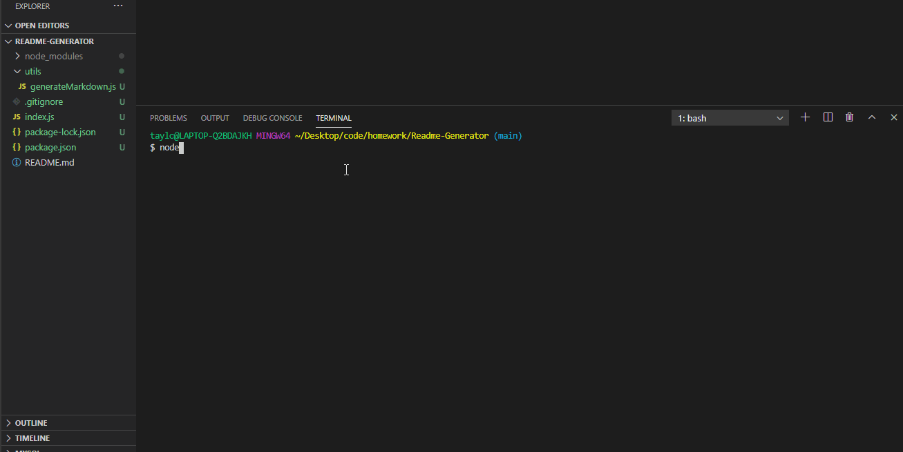

# Readme-Generator

## Task

To create a command-line based JavaScript program that will generate a Markdown file from the VS Code terminal.

## Functionality

The user will be  prompted to answer a series of input based and list based questions. Once the prompt has been completed the functional code should create a new markdown file within the utils folder.

## Deployment

Walk Through

The URL of the GitHub [repository](https://github.com/tweeks07/Readme-Generator)

## Contact Information
---
Taylor Weeks

Email: taylorlweeks707@gmail.com

[Github](https://github.com/tweeks07)
---
© 2021 Trilogy Education Services, LLC, a 2U, Inc. brand. Confidential and Proprietary. All Rights Reserved.